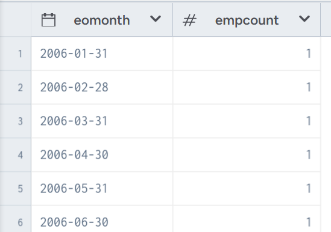

# Hands-On-Data-Science-using-SQL-Tableau-Python-and-Spark 

Link:https://www.linkedin.com/learning/hands-on-data-science-using-sql-tableau-python-and-spark
## Part 1 Analyzing Employee Data with SQL

Practice platform：dataworld

Dataset: employees.csv and dates.csv

（1）Employee starts

select MONTH(e.startdate), YEAR(e.startdate), count(1)

from employees e

group by MONTH(e.startdate), YEAR(e.startdate)

order by 2,1

Note：

This query is to search how many employees get in this company every month, its simple query, but I learned that : count(1) is similar to count(*), while in Oracle, this method can be faster; order by 2,1 means order by the columns of year and month that we select in the first row.

(2) Employee dates

select min(e.startdate), max(e.startdate)

from employees e

Note: know the date range

(3) Active Employees on Given Date

select e.startdate, e.enddate, e.*

from employees e

where e.startdate <= '2009-2-11'

and (e.enddate > '2009-02-11'

    OR

    e.enddate is NULL)

(4)Active Employees by Day

select d.fulldatealternatekey, COUNT(1) as empcount

from dates d join employees e

where e.startdate <= d.fulldatealternatekey

and (e.enddate > d.fulldatealternatekey or e.enddate is NULL)

group by d.fulldatealternatekey

order by 1

Note:  join is actually the 'cross join'

this query is to computer how many employees in this company every day, the result can show the trend during the time

(5) Active Employees Trend

WITH dl as (

    select DISTINCT DATE_ADD(DATE_ADD(DATE_TRUNC(dates.datekey,'month'),1,'month'),-1,'day') eomonth

    from dates

    )

select d.eomonth, COUNT(1) as empcount

from dl d join employees e

where e.startdate <= d.eomonth

and (e.enddate > d.eomonth or e.enddate is NULL)

GROUP BY d.eomonth

order by 1

result:

## Part 2 Sales Dashboard in Tableau

### Tableau Setup

Learn the tableau Public basic

### Exploring data visually in Tableau

Learn the basic function that how to build various chart and calculate the data to create new features that we need.

### Building a dashboard

Learn how to add filters and add actions across charts

[Personal Practice: Customer Analysis | Tableau Public](https://public.tableau.com/app/profile/yingzi.yuan/viz/PersonalPracticeCustomerAnalysis/Dashboard1)

![图片]
### Sales Analysis in Python

Tools: Jupyter notebook([Jupyter pip install](https://jupyter.org/install))

Learn how to use pandas to explore data information and make aggressions

Learn how to use matplotlib to draw pictures

## Part 3 Services Analysis in Spark

Learn Databricks and Spark basics

Learn how to use databricks to make a dashboard

![图片]
# Conclusion

In this course, I expand my technical knowledge about SQL, Tableau, Python, and Spark. Get hands-on, professional practice analyzing employee data with SQL, building a sales dashboard in Tableau, conducting sales analysis in Python, and analyzing services in Spark. It bring me more experience with data science tools, a good begginning is a half way, I will learn more later by myself.

